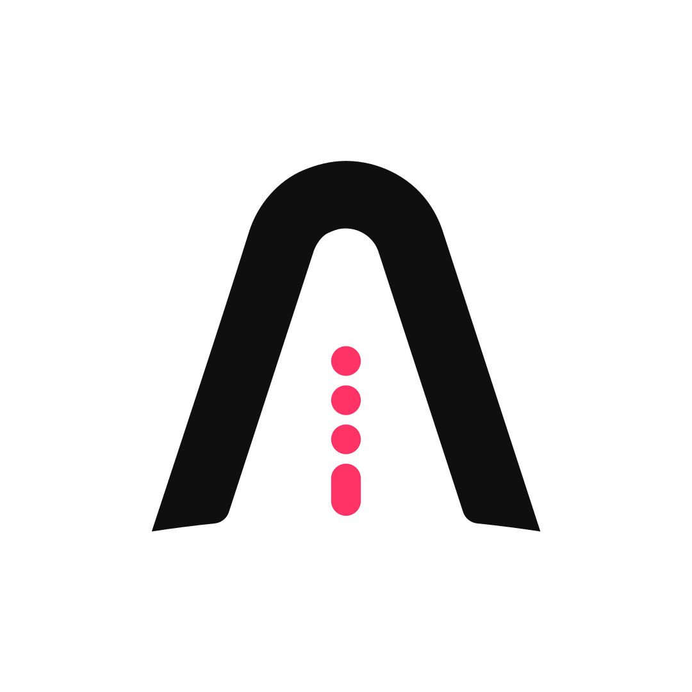

## A self-proclaimed visualnaut 🚀

>_visualnaut_ `/ˈviZH(o͞o)əlˌnôt/`
> _noun_ 
>a person who is trained to travel through lines, shapes, forms, and colors.

Hi folks 👋🏻, I'm Kersa, a self-taught developer and designer

Happen to adore designing but also love writing codes and front-end development is such a perfect combination of both worlds. In pursuit of an inclusive website where everyone can use the internet seamlessly.

Currently writing codes for [🐨 Qoala](https://www.qoala.app/), an insurtech with a vision to make insurance more accessible for everyone.

### ✍🏻 Personal Blog

I write some stuff about `design` and `coding` on my blog **[Notasi by VISUALNAUT](https://notasi.visualnaut.com)** 

### 📫 Say Hi!
- `📧 Email` (kersa@visualnaut.com)

### 🌏 Around the Internet

- `👨🏻‍💼 LinkedIn` ([linkedin.com/in/visualnaut/](https://www.linkedin.com/in/visualnaut/))
- `👨🏻‍🎨 Behance` ([behance.net/visualnaut](https://www.behance.net/visualnaut))
- `🐦 Twitter` ([twitter.com/visualnaut](https://twitter.com/visualnaut))
- `🖼 Instagram` ([instagram.com/visualnaut](https://instagram.com/visualnaut))

---
✦ Ancora Imparo
